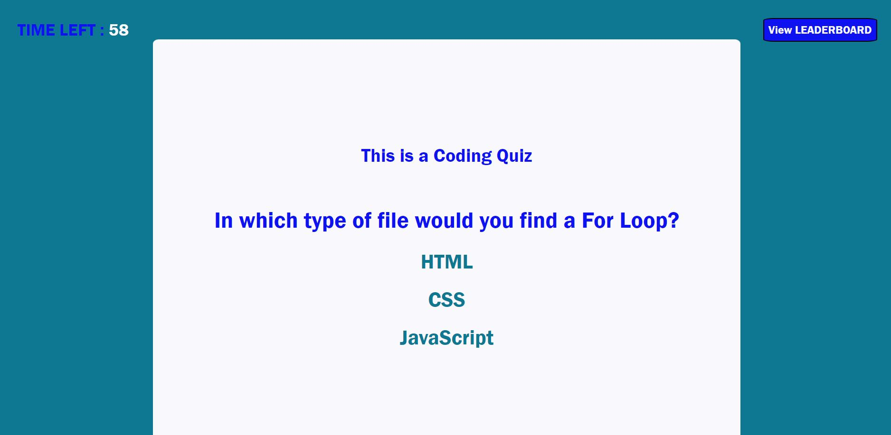

# Code Quiz
Module 4 Challenge: Web APIs

## Live Link
https://blakerichardburns.github.io/code-quiz/

## Repository Link
https://github.com/blakerichardburns/code-quiz

## Description
Intended to test skills involving JavaScript interactive functionality and Web APIs.

  ## Table of Contents
  * [Installation Instructions](#installation-instructions)
  * [Usage Information](#usage-information)
  * [Questions](#questions)

  ## Installation Instructions
  N/A
  
  ## Usage Information
  N/A 
  
  ## Questions
  For any inquiries, spam by inbox here: blakerichardburns@gmail.com
  To peruse more of my portfolio, check this out: [blakerichardburns](https://github.com/blakerichardburns)